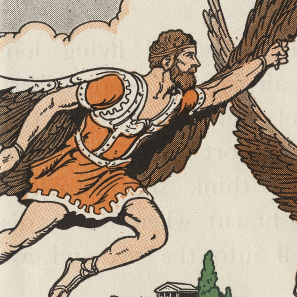

<h1>🦉 Team Daedalus 🦉</h1>

<h2>Guidelines & Progress</h2>
<ol>
  <li>Please refer to our <a href="https://docs.google.com/document/d/1Fdjj2FTlDFWk6_iApQpDqmLbYmIvDvza_bQweYKV3mI/edit?usp=sharing">Work Guide</a> for git conventions and Trello usage.</li>
  <li>Please refer to our <a href="https://trello.com/b/4mTLllhM/dev">Trello Board</a> for live development progress.</li>
</ol>

